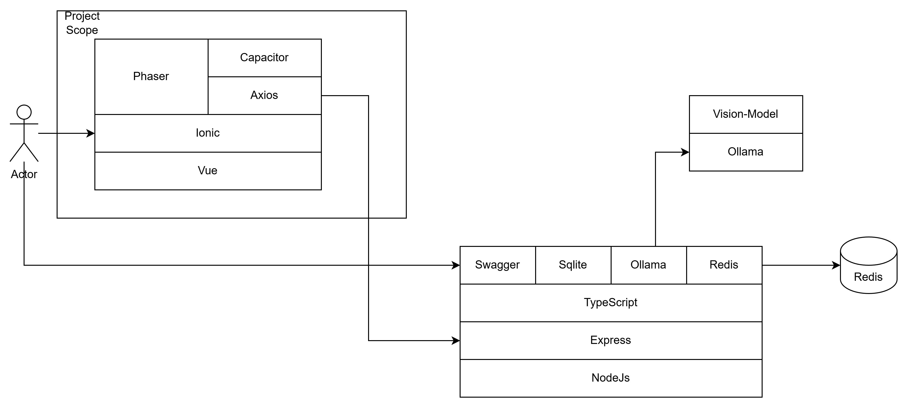

# Phaser Vue3 Typescript Sample Project

In order to make a game with Vue3 and Phaser3, which can be serviced with Web Browser, PlayStore and App Store. 
This sample project can be used as a base for the game development. Additionally, we will experiment with applying multi-modal vision AI to games.
These games should be Casual Games or In-flight Entertainment Games.

I am trying to make several games with this project and I will update the project with the games.
If you have any questions or suggestions, please contact me via email angry07@naver.com.

## 1. Architecture


## 2. Frameworks and Libraries
```
- Vue 3
- Vue Router
- Phaser 3
- Vite
- Ionic
- TypeScript
- Axios / Capacitor-HTTP
```


## 3. Docker container creation and execution command
```
npm run build
docker build -t vue3-demo:local .  && docker run -p 9090:80 vue3-demo:local
```

## 4. Build for Android Project
```
ionic build
ionic capacitor sync android
```